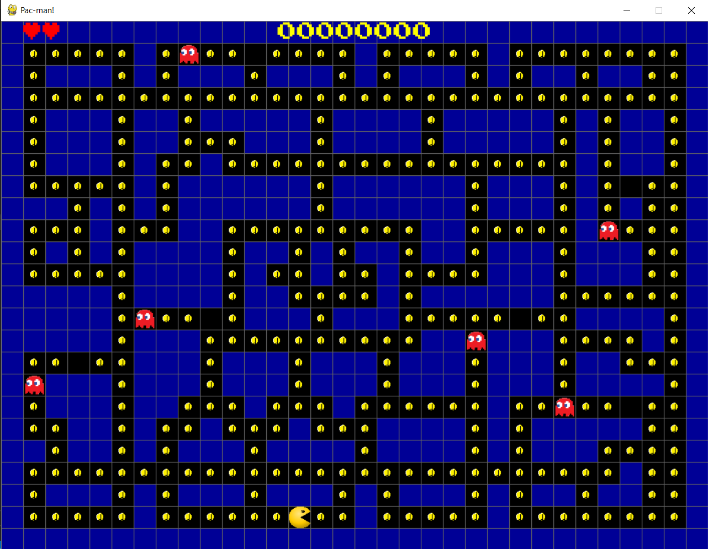

# Pygame

Repositório para o trabalho final de Design de Software, 1° período de engenharia, Insper, 2021.2

 
 

## Pacman

 
 
 
[Link para um vídeo de apresentação](https://youtu.be/Zvlz4NQfeUE)

 
 

## Membros
- Arthur Moreira Tamm
- Guilherme Scopel Lemos
- Vitor de Morais Caixeta

 
 

## Descrição

- O jogo se baseia no clássico dos anos 1980 [Pacman](https://pacman.cc/), em que um personagem principal deve pegar todas as moedas antes que seja morto por algum dos fantasmas

- O pacman começa com duas vidas, cada moeda garante um total de 100 pontos e, em caso de perda de uma das vidas, o jogador recebe um ônus de 1000 pontos

- O jogo possui três mapas diferentes que podem ser selecionados através da escolha do nível

- Para executar o jogo é necessário rodar o arquivo "main"

 
 

## Controles

- O Pacman move para cima, para baixo e para os lados, através das setas do teclado 

 
 

## Referências para o desenvolvimento

- [Tutorial de pygame kidscancode](https://www.youtube.com/watch?v=3UxnelT9aCo&list=PLsk-HSGFjnaH5yghzu7PcOzm9NhsW0Urw&index=37)

- [Tutorial de animação de rotação pygame](https://www.youtube.com/watch?v=eGsMMpAglIg)

- [Efeitos sonoros do Pacman](http://www.classicgaming.cc/classics/pac-man/sounds)
